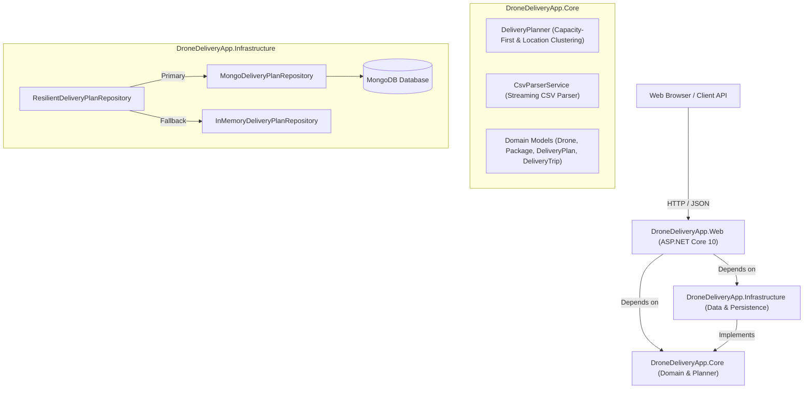

# AeroRoute System Architecture

This document describes the high-level software architecture, module breakdown, and design principles powering **AeroRoute**.

---

## 🏛️ High-Level Architecture

AeroRoute follows **Clean Architecture** principles, separating domain logic, data persistence, and UI presentation into distinct, decoupled projects.

---

## 📦 Layered Responsibilities

### 1. `DroneDeliveryApp.Core` (Class Library)
- **Domain Entities**: `Drone`, `Package`, `DeliveryTrip`, `DronePlan`, `DeliveryPlan`, `UnassignedPackage`.
- **Abstractions**: `IDeliveryPlanner`, `ICsvParserService`, `IDeliveryPlanRepository`.
- **DeliveryPlanner**: Core optimization engine. Sorts drones descending by capacity, separates overweight packages, clusters same-location packages into unified trips, and maximizes payload utilization.
- **CsvParserService**: Zero-allocation streaming CSV parser. Accepts line-by-line bracketed CSV (`[DroneA], [200]`), plain CSV, and multi-column tabular CSV (`Type, Name, Weight, Location`).

### 2. `DroneDeliveryApp.Infrastructure` (Class Library)
- **Settings**: `MongoDbSettings` mapped from environment variables or `appsettings.json`.
- **MongoDeliveryPlanRepository**: Interacts with MongoDB using `MongoDB.Driver 3.11.1`.
- **InMemoryDeliveryPlanRepository**: Thread-safe `ConcurrentDictionary` store.
- **ResilientDeliveryPlanRepository**: Proxy pattern implementation that delegates persistence to MongoDB when active and falls back to In-Memory storage without throwing exceptions if MongoDB is offline.

### 3. `DroneDeliveryApp.Web` (ASP.NET Core Application)
- **Controllers**: `DeliveryPlanController` providing endpoints for file upload planning, history querying, detail inspection, deletion, and sample CSV downloads.
- **Middleware**: Static file serving, CORS policies, Swagger/OpenAPI documentation (`/swagger`), native health checks (`/healthz`).
- **UI Dashboard**: Modern dark mode glassmorphism UI built with HTML5, Tailwind CSS, FontAwesome, and vanilla ES6 JavaScript.

### 4. `DroneDeliveryApp.Tests` (xUnit Test Project)
- Covers capacity ordering, same-location package grouping, overweight package flags, large-dataset stress tests (5,000+ items in < 200 ms), and CSV parser edge cases.
