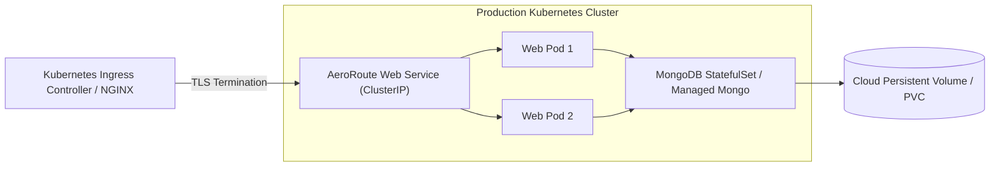

# AeroRoute Deployment Model & Infrastructure

This document details the deployment architecture, container topology, networks, volume management, and environment configurations for **AeroRoute**.

---

## 🐳 Docker Compose Deployment Diagram

```mermaid
graph TD
    UserClient["Client Web Browser / HTTP Requests"] -->|Port 8080:80| WebContainer["AeroRoute Web App Container (aeroroute-web)"]
    
    subgraph Docker Network ["aeroroute-network (Bridge)"]
        WebContainer -->|DNS mongo:27017| MongoContainer["MongoDB Container (aeroroute-mongo)"]
        
        subgraph WebContainerDetails ["Web App Service"]
            DotnetRuntime[".NET 10 ASP.NET Core Runtime"]
            StaticUI["Static Web Assets (wwwroot)"]
            AppConfig["Env: ConnectionStrings__MongoDB"]
        end
        
        subgraph MongoContainerDetails ["Database Service"]
            MongoEngine["MongoDB 7.0 Engine"]
            VolMount["Volume: mongo_data -> /data/db"]
        end
    end

    VolMount --> HostStorage[("Host Persistent Disk Storage")]
```

---

## ⚙️ Container Configuration Details

### 1. Web Application Container (`aeroroute-web`)
- **Base Image**: `mcr.microsoft.com/dotnet/aspnet:10.0`
- **Internal Port**: `80`
- **External Port Mapping**: `8080:80`
- **Environment Settings**:
  - `ASPNETCORE_ENVIRONMENT=Production`
  - `ConnectionStrings__MongoDB=mongodb://mongo:27017`
  - `MongoDbSettings__DatabaseName=DroneDeliveryDb`
  - `MongoDbSettings__CollectionName=DeliveryPlans`

### 2. MongoDB Container (`aeroroute-mongo`)
- **Image**: `mongo:latest`
- **Internal Port**: `27017`
- **External Port Mapping**: `27017:27017`
- **Volume Mount**: `mongo_data:/data/db`

---

## 🌐 Production Topology & Kubernetes Guidelines

### Production Checklist
1. **Secrets Management**: Inject `ConnectionStrings__MongoDB` via Kubernetes Secrets or Azure Key Vault / AWS Secrets Manager.
2. **Health Probes**: Configure Liveness and Readiness probes pointing to `/healthz`.
   - `livenessProbe`: `GET /healthz` (initialDelaySeconds: 10, periodSeconds: 15)
   - `readinessProbe`: `GET /healthz` (initialDelaySeconds: 5, periodSeconds: 10)
3. **Horizontal Pod Autoscaling (HPA)**: Target CPU utilization > 75% for auto-scaling Web Pods.
