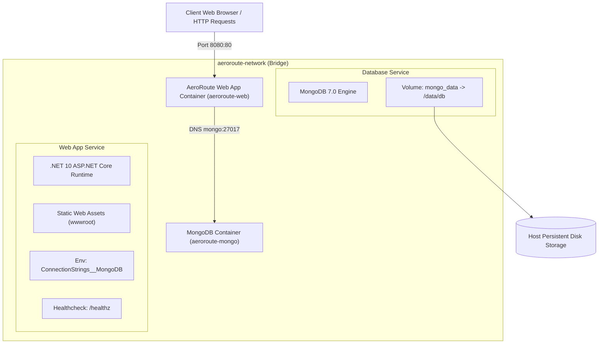
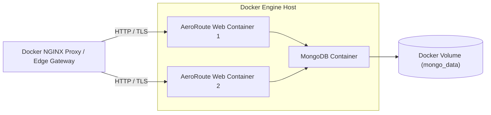

# AeroRoute Deployment Model & Infrastructure

This document details the container deployment model for **AeroRoute**, based exclusively on **Docker & Docker Compose**.

---

## 🐳 Docker Compose Architecture Diagram



---

## ⚙️ Container Configuration Details

### 1. Web Application Container (`aeroroute-web`)
- **Base Image**: `mcr.microsoft.com/dotnet/aspnet:10.0`
- **Internal Port**: `80`
- **External Port Mapping**: `8080:80`
- **Environment Settings**:
  - `ASPNETCORE_ENVIRONMENT=Production`
  - `ConnectionStrings__MongoDB=mongodb://mongo:27017`
  - `MongoDbSettings__DatabaseName=DroneDeliveryDb`
  - `MongoDbSettings__CollectionName=DeliveryPlans`

### 2. MongoDB Container (`aeroroute-mongo`)
- **Image**: `mongo:latest`
- **Internal Port**: `27017`
- **External Port Mapping**: `27017:27017`
- **Volume Mount**: `mongo_data:/data/db`

---

## 🚀 Docker Production Container Topology Diagram



---

## 🛡️ Docker Container Health Checks & Operations

AeroRoute integrates Docker native container health checks utilizing the `/healthz` HTTP endpoint:

### Docker Compose Healthcheck Configuration
```yaml
services:
  web:
    build: .
    healthcheck:
      test: ["CMD", "curl", "-f", "http://localhost/healthz"]
      interval: 15s
      timeout: 5s
      retries: 3
      start_period: 10s
```

### Production Docker Container Guidelines
1. **Secrets Management**: Pass sensitive connection strings using Docker Compose `.env` files or Docker Secrets.
2. **Container Monitoring**: Monitor container health status using `docker ps` and native Docker healthcheck statuses.
3. **Data Persistence**: Always use named Docker volumes (`mongo_data`) to prevent data loss across container recreations.
