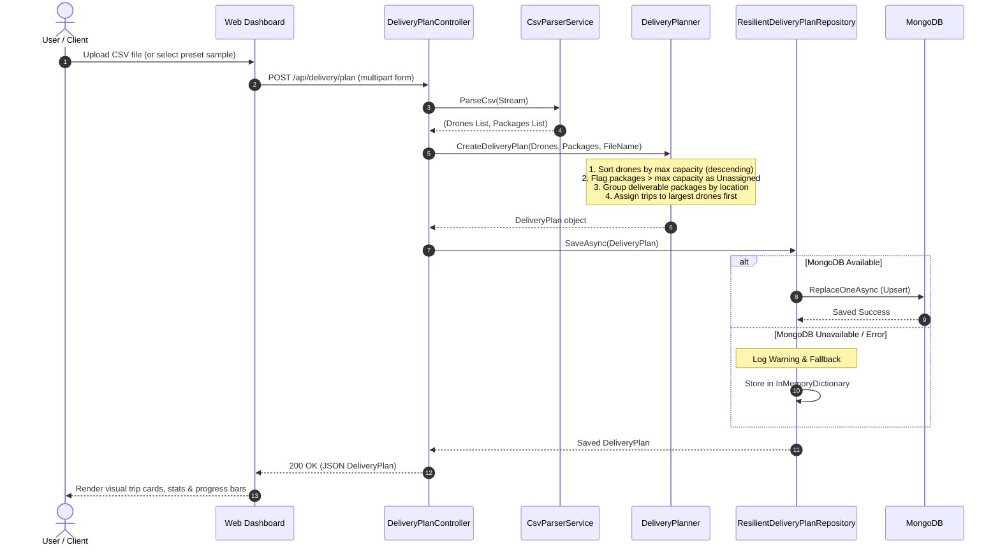
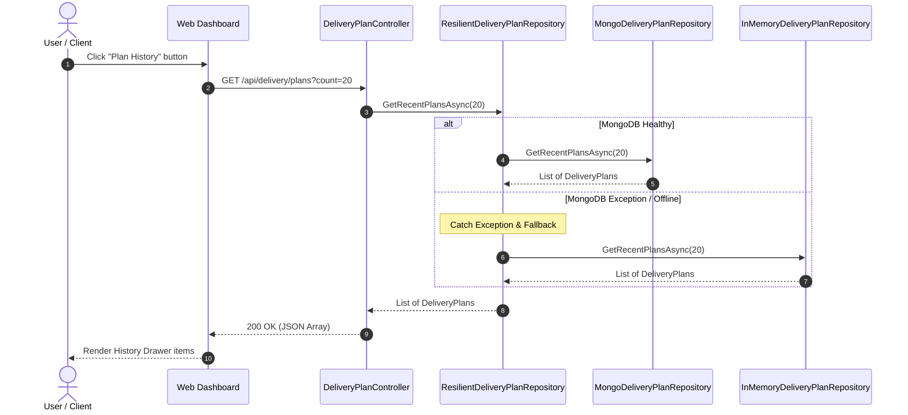

# AeroRoute Sequence Diagrams

This document illustrates the execution flow for key system operations in **AeroRoute** using Mermaid sequence diagrams.

---

## 1. CSV Upload & Delivery Plan Generation Sequence

This diagram shows the end-to-end flow when a user uploads a CSV file to generate an optimized delivery plan.

---

## 2. Plan History Retrieval & Resilience Fallback Sequence

This diagram shows the flow when retrieving past delivery plans with automatic resilience fallback.

