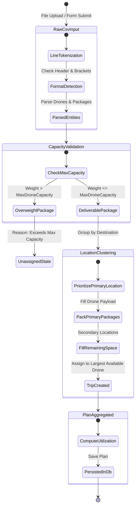
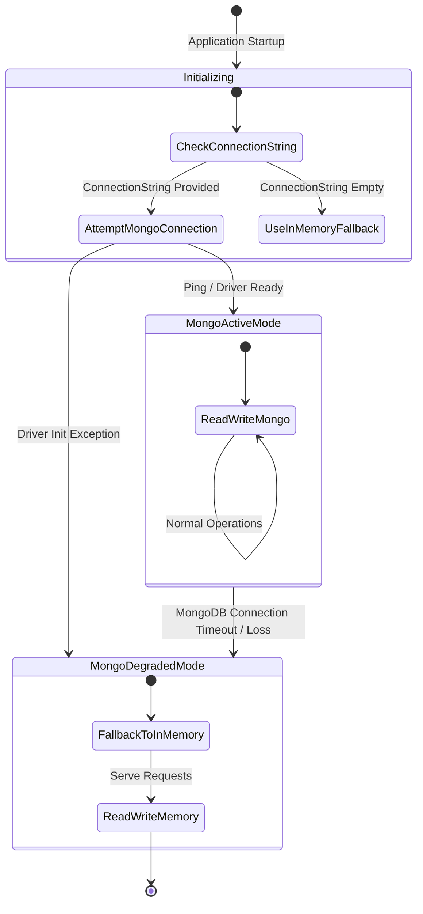

# AeroRoute State Diagrams

This document defines the lifecycle states for Delivery Plans and Repository Resilience Modes in **AeroRoute** using Mermaid state diagrams.

---

## 1. Delivery Plan & Package Routing Lifecycle State Diagram

This state diagram tracks how CSV inputs transition from raw text to scheduled drone delivery trips or unassigned warnings.

---

## 2. Repository Resilience & Storage Mode State Diagram

This state diagram depicts how `ResilientDeliveryPlanRepository` dynamically manages database connection states between MongoDB and In-Memory fallback mode.

